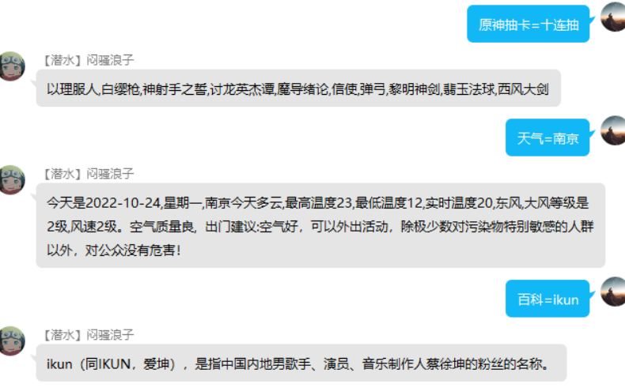

```azure
这是一个QQ群机器人，已支持天气查询，百度百科查询，原神模拟抽卡(保底TODO),每日干饭推荐
```
前提条件
配置go-cqhttp [文档地址](https://docs.go-cqhttp.org/guide/#go-cqhttp)
相关操作示例[demo](https://blog.csdn.net/tagagi/article/details/121089116)
```azure
基于go-cqhttp实现,基于go-cqhttp模拟QQ客户端对外提供api来调用，获取聊天记录进行一些业务上的操作
安装就不赘述了
```

相关操作(安装完成go-cqhttp完成登录和配置文件修改)
```azure
修改 global/global.go文件的LOCALHOSTPORT为自己的服务器地址
修改 global/global.go文件的DAIBIAODAHUI为目标的群号
开启服务
```
```azure
天气查询
    exp: 天气=location location为市级地址
百科查询
    exp: 百科=param param为查询参数
原神抽卡
    exp: 原神抽卡=单抽  //注  目前只支持单抽或者十连抽
每日干饭推荐
    根据global/global.go的CRON设置实现定时任务，本项目是三小时跑一次    
```
原神抽卡
```azure
项目版本是3.0版本，如要修改行在utils/genshinconfig.go内修改常驻和UP池
```
每日干饭推荐
```azure
目前支持200种菜谱，如要修改请在Menus/menus修改，默认json格式。GetMenuInfo方法为本项目的爬取菜单过程
```


```azure
此项目闲暇之余写着练手，有很多地方可以进行优化，比如制定协议，使用goroutine和channel发挥golang的特性，根据go-cqhttp对外提供的API接口可以进行更多的业务操作
    如有问题可以跟我联系QQ:1321291309,我的邮箱losanming@163.com

```